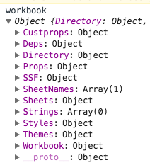

## 客户端excel的导入与导出
引入js-xlsx库，实现用户导入excel自动填充页面内表格数据、导出页面表格数据到excel文件、根据excel自动生成枚举文件等功能；

<!-- ### 运行环境

    js-xlsx版本为0.10.3
    操作系统OSX 10.12.5
    处理器 2.7Ghz I5
    内存 8GB
    浏览器版本 Chrome 58.0 -->

### 客户端导入excel
#### 应用场景
点击按钮上传excel文件，将excel文件中的数据导入页面的表格内；

#### 能做哪些
导入多张sheet、导入时单元格合并(部分情况存在bug)，导入原格式的数据，根据页面需要只导入指定列

#### 示例代码
```js
class App extends React.PureComponent {
    ...
    importFile() {
        ...
    }
    render() {
        return (
            <div>
                <input type="file" id="test" onChange={this.importFile}/>
                <Button type="primary" onClick={this.downloadExcel}>导出</Button>
                <Table
                    dataSource={testData}
                    columns={columns}
                    rowKey="1"
                />
            </div>
        )
    }
}

```
#### 实现步骤

```js
//importFile()
//获取上传的文件
const file = document.getElementById("test").files[0];
const reader = new FileReader();
//读取文件
reader.readAsBinaryString(file);
//读取完成后，在onload的回调中处理数据，
reader.onload = e => {
    //获取读取的二进制字符数据
    const data = e.target.result;
    //调用XLSX的read方法，转化为方便操作的对象集合
    //type为xlsx用库如何解析数据,wordbook结构见下图；
    const workbook = XLSX.read(data, {type: 'binary'});
    //获取excel里每个单元格的数据
    const ws2 = workbook.Sheets[workbook.SheetNames[0]];
    //54~56 操作为去掉第一行的数据
    const range = XLSX.utils.decode_range(ws2['!ref']);
    range.s.r = 1;
    ws2['!ref'] = XLSX.utils.encode_range(range);
    //将excel的数据转化为需要的json格式的数据
    const sheetJson = XLSX.utils.sheet_to_json(ws2, {defval: '', raw: true, header: ["EnumName", "Type", "Key"]});
    const columns = [];
    const dataSource = [];
    sheetJson.forEach(item => {
        ...
    })
}
```


#### 遇到的问题
1. IE11及以下版本不支持readAsBinaryString，需要在组件内判断是否支持readAsBinaryString，调用readAsArrayBuffer处理数据需要额外调用两个方法去处理数据;
2. sheet中数据有缺省时，导入后会引起单元格错位，需要配置defal字段来设置默认值;
3. 转化json数据时，官方文档提供的sheetRows属性无法使用，需要手动设置！ref的值来去掉excel的表头;
4. 存在单元格合并时，需要获取！merge的值，手动计算每个合并单元格的区间，并设置ant所需的rowspan和colspan，当表格分页时，单元格合并会出现bug;
5. 手动删除sheet里面的数据后，导入时空白行仍会被识别，需手动处理;

#### 性能


### 客户端导出excel
#### 应用场景
点击按钮下载excel文件，将页面的表格内的数据导出到excel中；

#### 能做哪些
1. 导出多张sheet、导出时单元格合并、导出原格式的数据(部分)、根据页面需要只导出指定列；
2. 导出时支持部分样式(行高、列宽、边距)，目前不支持的(边框、颜色、超链接样式、居中),可通过[xlsx-style](https://github.com/protobi/js-xlsx)来扩展样式;
3. 导出多种格式，xlsx、xls(存在bug)、csv(实现方式需重写);


#### 实现步骤
```js
//获取表格的数据
const {dataSource, columns1} = dataJson;
const excledata = {};//用来保存转换好的json
//定义导出excel的起始和结束位置
const startPos = 'A1';
let endPos = '';
// 设置excel中表头的位置
columns.forEach((k, j) => {
    const position = String.fromCharCode(65 + j) + 1;
    const value = k.title;
    excledata[position] = {
        position,
        v: value
    }
});
//设置excel中数据的位置
dataSource.forEach((v, i) => columns1.forEach((k, j) => {
    const position = String.fromCharCode(65 + j) + (i + 2);
    const value = v[k.key];
    if(i === (dataSource.length - 1) && j === (columns1.length - 1))
        endPos = position;
    excledata[position] = {
        position,
        v: value
    }
    //按格式定义要导出的内容
    const workbook = {
        SheetNames: ['exportExcel'], //保存的表标题
        Sheets: {
            'exportExcel': Object.assign({},
                excledata, //内容
                {
                    '!ref': `${startPos}:${endPos}` //设置填充区域
                }
                //可配置项{!margins, !merges','!cols'...}                    
            )
        }
    };
    //转化xlsx导出的blob格式
    const exportExcel = new Blob([this.s2ab(XLSX.write(workbook,
        {
            bookType: 'xlsx',//输出的文件格式
            type: 'binary',//这里的数据是用来定义导出的格式类型
        }))], {
        type: ""
    });
    //调用file-saver的saveAs方法，导出excel
    saveAs(exportExcel, `测试数据.xlsx`);
}));

```
#### 遇到的问题
1. 若存在合并单元格时，需要先计算rolspan和colspan，然后在！merge属性中转化为特定格式的值进行配置；
2. 表头多行时，需要修改处理逻辑；
3. 导出时要求特殊格式的，可以通过配置SSF选项，在单元格属性里面修改后再导出;目前支持的有超链接、日期(实现存在bug)，
不支持样式;
4. (待解决)导出xls格式时，根据官方文档设置{bookType: 'biff2'},输出为空，根据issue里面提示，处理包含中文字段的数据可能存在bug,切换为英文后，仍然导出为空;
5. 客户端导出需要依赖file-saver库，xlsx不支持下载

#### 性能


### 服务端导出枚举文件
根据导出excel同样的方式，采用模板字符串拼接数据，使用node.js来写入文件;

#### 应用场景
构建项目时或切换多语言时，自动生成枚举文件;

#### 实现步骤
数据处理同excel导出；
```js
const sheetJson = XLSX.utils.sheet_to_json(ws2, {defval: '', raw: true, header: ["EnumName", "Key", "Name", "CN", "EN"]});
const test2obj = {};
let valtest = '';
// 将excel的数据转化为方便凭借字符串的数据格式
test2.forEach(item => {
    if(item.EnumName !== '' && item.EnumName !== valtest) {
        valtest = item.EnumName;
        test2obj[item.EnumName] = {
            [item.CN]: item.Key,
            properties: {
                [item.Key]: {
                    ['zh-CN']: item.CN,
                    ['en-US']: item.EN
                }
            }
        }
    } else {
        test2obj[valtest] = Object.assign(test2obj[valtest], {
            [item.CN]: item.Key,
            properties: Object.assign(test2obj[valtest].properties, {
                [item.Key]: {
                    ['zh-CN']: item.CN,
                    ['en-US']: item.EN
                }
            })
        })
    }
});
//定义字符串模板处理方法
const templeStr = (obj, name) => {
    let str = '\t__proto__: Enum,\n';
    for(let key in obj) {
        if(key !== 'properties')
            str += `\t${key}: ${obj[key]},\n`
        else {
            const k = obj[key];
            let strItem = '';
            for(let p in k) {
                const val = k[p];
                const strLanguage = `Object.freeze({
            __proto__: Enum,
            ['zh-CN']: '${val['zh-CN']}',
            ['en-US']: '${val['en-US']}'
        }),`;
                strItem += `\t\t${p}: ${strLanguage}\n`
            }
            str += `\tproperties: Object.freeze({\n${strItem}\t}),\n`;
        }
    }
    return `export const ${name} = Object.freeze({\n${str}});\n`;
};
let fileStr = `import {Enum, EnumItem} from './enumType';\n`;
//拼接字符串
for (let f in test2obj) {
    const obj = test2obj[f];
    fileStr += templeStr(obj, f);
};
//写入文件
fs.writeFile('meiju.js', fileStr, {flag: 'w'}, function(err) {
   if (err) {
       return console.error(err);
   }
});
```

#### 遇到的问题
1.
